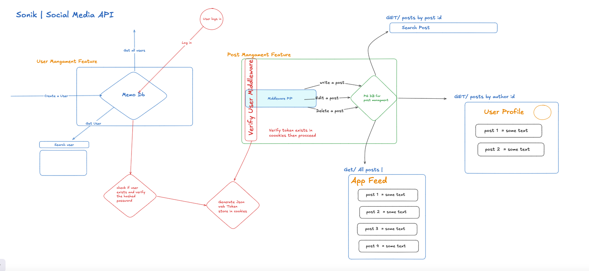

## Features

Here is the blueprint for the project:



Certainly! Below is a README template that outlines the endpoints you've defined in your Express.js application. This template includes sections for installation, usage, and detailed descriptions of each endpoint.

````markdown
# API Documentation

This document provides an overview of the API endpoints available in this application.

## Table of Contents

## Usage

To interact with the API, you can use tools like Postman, Insomnia, or any HTTP client. Ensure you have a valid token for authorization when making requests to protected endpoints.

### Authentication

Some endpoints require a valid user session. Use the `/login` endpoint to authenticate and obtain a session token.

## Endpoints

### Posts

#### 1. Create a Post

- **POST** `/post`
- **Authorization**: Required
- **Request Body**:
  ```json
  {
    "content": "String",
    "authorId": "String"
  }
  ```
- **Response**:
  - **201 Created**: The post was successfully created.
  - **400 Bad Request**: Invalid input.

#### 2. Get All Posts

- **GET** `/posts`
- **Authorization**: Required
- **Response**:
  - **200 OK**: Returns an array of posts.
  - **204 No Content**: No posts found.

#### 3. Update a Post

- **PATCH** `/posts/:id`
- **Authorization**: Required
- **Request Body**:
  ```json
  {
    "content": "String"
  }
  ```
- **Response**:
  - **200 OK**: The post was successfully updated.
  - **404 Not Found**: The post does not exist.
  - **400 Bad Request**: Invalid input.

#### 4. Delete a Post

- **DELETE** `/posts/:id`
- **Authorization**: Required
- **Response**:
  - **204 No Content**: The post was successfully deleted.
  - **404 Not Found**: The post does not exist.

#### 5. Get Posts by Author

- **GET** `/posts/:authorid`
- **Authorization**: Required
- **Response**:
  - **200 OK**: Returns an array of posts by the specified author.
  - **204 No Content**: No posts found for the specified author.

### Users

#### 1. Create a User

- **POST** `/user`
- **Request Body**:
  ```json
  {
    "name": "String",
    "email": "String",
    "password": "String"
  }
  ```
- **Response**:
  - **201 Created**: The user was successfully created.
  - **400 Bad Request**: Invalid input.

#### 2. Login User

- **POST** `/login`
- **Request Body**:
  ```json
  {
    "email": "String",
    "password": "String"
  }
  ```
- **Response**:
  - **200 OK**: Successful login, returns a token.
  - **401 Unauthorized**: Invalid credentials.

#### 3. Get All Users

- **GET** `/users`
- **Authorization**: Required
- **Response**:
  - **200 OK**: Returns an array of users.
  - **204 No Content**: No users found.

#### 4. Get User by ID

- **GET** `/users/:id`
- **Authorization**: Required
- **Response**:

  - **200 OK**: Returns user details.
  - **404 Not Found**: User does not exist.

- Create a video recording where you present your work, and publish on YouTube.

## Presentation video requirements

- Keep the presentation short and relevant.
- The video should have your screen shared, and yourself via video. OBS can be used to set it up.
- The audio should be good enough quality that we can listen to it in the office on the big screen.
- The video content should be large enough to see on a larger mobile phone.
- Your presentation should have these segments, in this given order: `Who are you?`, `What did you build?`, `What's your big picture plan?`, `Showing the project board, explain your ways of working throughout the weekend.`, `Prove that the app can be run normally.`, `Demo the test cases to prove that the application works completely.`, `Show code that fulfilled a part of the requirements. Make it clear what piece of code fulfilled what requirement.`.

## Notes

- You will be scored on the content of the video recording. Make sure all relevant parts are presented to be properly evaluated.
- Make sure that it's easy to score you on each requirement by addressing what requirement you fulfilled in the different segments in your presentation.
````
