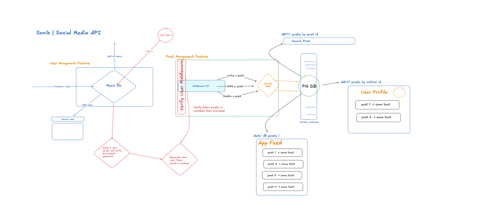

Here’s a revised version of your README with improved structure, clarity, and a few extra details for easier understanding.

````markdown
# Project API Documentation

This README provides an overview of the API endpoints available in this application, as well as instructions for installation, usage, and an outline of a video presentation for project demonstration.

## Features

Here is the blueprint for the project:



---

## Table of Contents

- [Installation](#installation)
- [Usage](#usage)
- [Postman Collection](#PostmanCollection)
- [Authentication](#authentication)
- [Endpoints](#endpoints)
  - [Posts](#posts)
  - [Users](#users)
- [Presentation Video Requirements](#presentation-video-requirements)
- [Notes](#notes)

---

## Installation

1. Clone this repository to your local machine.
2. Install the dependencies:
   ```bash
   npm install
   ```
````

3. Set up environment variables as needed for your configuration, including database connection strings and authentication keys.
4. Start the server:
   ```bash
   npm start
   ```
5. Use tools like Postman, Insomnia, or any HTTP client to test the API endpoints.

---

## Usage

To interact with the API, you can use tools like Postman, Insomnia, or any HTTP client. Ensure that you have a valid token for authorization when making requests to endpoints requiring authentication.

### Authentication

Some endpoints require a valid user session. Use the `/login` endpoint to authenticate and obtain a session token, which will be required for protected endpoints.

## Postman Collection

You can access the Postman collection for this project [here](https://spicy5.postman.co/workspace/spicy-Workspace~e3a1d0b4-8e1e-4416-8486-e1dca30dd627/collection/19840737-75070e22-8b6b-4a48-b9a3-968fd043aefd?action=share&creator=19840737).

## Youtube Video

You can access the vedio for this project [here](https://youtu.be/tc4dXAsIz00).

---

## Endpoints

### Posts

#### 1. Create a Post

- **Method**: `POST`
- **URL**: `/post`
- **Authorization**: Required
- **Request Body**:
  ```json
  {
    "content": "String",
    "authorId": "String"
  }
  ```
- **Response**:
  - **201 Created**: The post was successfully created.
  - **400 Bad Request**: Invalid input.

#### 2. Get All Posts

- **Method**: `GET`
- **URL**: `/posts`
- **Authorization**: Required
- **Response**:
  - **200 OK**: Returns an array of posts.
  - **204 No Content**: No posts found.

#### 3. Update a Post

- **Method**: `PATCH`
- **URL**: `/posts/:id`
- **Authorization**: Required
- **Request Body**:
  ```json
  {
    "content": "String"
  }
  ```
- **Response**:
  - **200 OK**: The post was successfully updated.
  - **404 Not Found**: The post does not exist.
  - **400 Bad Request**: Invalid input.

#### 4. Delete a Post

- **Method**: `DELETE`
- **URL**: `/posts/:id`
- **Authorization**: Required
- **Response**:
  - **204 No Content**: The post was successfully deleted.
  - **404 Not Found**: The post does not exist.

#### 5. Get Posts by Author

- **Method**: `GET`
- **URL**: `/posts/:authorid`
- **Authorization**: Required
- **Response**:
  - **200 OK**: Returns an array of posts by the specified author.
  - **204 No Content**: No posts found for the specified author.

### Users

#### 1. Create a User

- **Method**: `POST`
- **URL**: `/user`
- **Request Body**:
  ```json
  {
    "name": "String",
    "email": "String",
    "password": "String"
  }
  ```
- **Response**:
  - **201 Created**: The user was successfully created.
  - **400 Bad Request**: Invalid input.

#### 2. Login User

- **Method**: `POST`
- **URL**: `/login`
- **Request Body**:
  ```json
  {
    "email": "String",
    "password": "String"
  }
  ```
- **Response**:
  - **200 OK**: Successful login, returns a token.
  - **401 Unauthorized**: Invalid credentials.

#### 3. Get All Users

- **Method**: `GET`
- **URL**: `/users`
- **Authorization**: Required
- **Response**:
  - **200 OK**: Returns an array of users.
  - **204 No Content**: No users found.

#### 4. Get User by ID

- **Method**: `GET`
- **URL**: `/users/:id`
- **Authorization**: Required
- **Response**:
  - **200 OK**: Returns user details.
  - **404 Not Found**: User does not exist.

---
